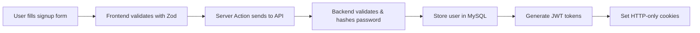
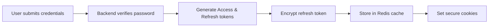

# Full-Stack Authentication System (Next.js + Node.js + MySQL + Redis)

## 🚀 Project Overview

This is a comprehensive **full-stack authentication system** built with modern web technologies. It demonstrates a production-ready authentication flow with secure token management, password hashing, and session handling using HTTP-only cookies.

## 🏗️ Architecture

The project follows a **microservices architecture** with separate frontend and backend applications:

```
📦 FS_Auth_ReactJS/
├── 🎨 frontend/          # Next.js 15 React Application
├── ⚙️ backend/           # Node.js Express API Server
├── 🗄️ MySQL Database    # User data storage
└── 🔄 Redis Cache       # Token management & session storage
```

## 💻 Technology Stack

### **Frontend (Next.js 15)**
- **Framework**: Next.js 15 with React 19
- **Styling**: Tailwind CSS v4 + Framer Motion animations
- **Language**: TypeScript
- **Authentication**: Axios interceptors + Server Actions
- **Validation**: Zod schema validation
- **State Management**: useActionState for form handling
- **UI Components**: Heroicons for icons

### **Backend (Node.js + Express)**
- **Runtime**: Node.js with TypeScript
- **Framework**: Express.js
- **Database**: MySQL2 with connection pooling
- **Cache**: Redis for session/token storage
- **Security**: 
  - Helmet for HTTP headers security
  - bcrypt for password hashing
  - JWT for authentication tokens
  - Crypto for refresh token encryption
- **Middleware**: CORS, cookie-parser, morgan logging

### **Database & Cache**
- **Primary Database**: MySQL (containerized with Docker)
- **Cache Layer**: Redis (containerized with Docker)
- **Data Persistence**: Docker volumes for data retention

## 🔐 Authentication Flow

### **1. User Registration**


### **2. User Login**


### **3. Token Management**
- **Access Token**: Short-lived (1 hour), used for API requests
- **Refresh Token**: Long-lived (30 days), encrypted and stored in Redis
- **Automatic Refresh**: Middleware handles token renewal seamlessly

## 📁 Project Structure

### **Backend Structure**
```
backend/src/
├── app.ts                    # Express app configuration
├── index.ts                  # Server entry point
├── encryption/               # Data encryption utilities
├── handlers/
│   └── user-handler.ts      # User CRUD operations
├── middlewares/
│   ├── auth.middleware.ts   # Authentication validation
│   └── jwt-token-validator.ts
├── mysql/
│   ├── connection.ts        # Database connection pool
│   ├── queries.ts          # SELECT statements
│   ├── mutations.ts        # INSERT/UPDATE/DELETE
│   └── tables.ts           # Database schema
├── redis/
│   ├── connection.ts       # Redis client setup
│   └── actions.ts          # Cache operations
├── routers/
│   ├── index.ts            # Main router
│   ├── user.ts             # User routes
│   └── validation.ts       # Route validation
├── token/
│   └── jwt-token-manager.ts # JWT operations
└── utils/
    └── helpers.ts          # Utility functions
```

### **Frontend Structure**
```
frontend/app/
├── layout.tsx               # Root layout component
├── page.tsx                # Home page
├── globals.css             # Global styles
├── (auth)/                 # Authentication pages group
│   ├── AuthForm.tsx        # Reusable auth form component
│   ├── login/page.tsx      # Login page
│   └── signup/page.tsx     # Signup page
├── actions/
│   └── form-actions.tsx    # Server Actions for forms
├── lib/
│   ├── axios.ts            # HTTP client configuration
│   ├── cookies.ts          # Cookie utilities
│   ├── definitions.ts      # Type definitions
│   └── validateAuth.ts     # Authentication validation
└── profile/
    ├── page.tsx            # Protected profile page
    └── ProfileCard.tsx     # Profile display component
```

## 🔒 Security Features

### **Password Security**
- **bcrypt hashing** with salt rounds (10)
- **No plain text** password storage
- **Password validation** on both client and server

### **Token Security**
- **JWT signed tokens** with expiration
- **Refresh token encryption** using Node.js crypto
- **HTTP-only cookies** prevent XSS attacks
- **SameSite=lax** prevents CSRF attacks

### **API Security**
- **Helmet middleware** sets security headers
- **CORS configuration** for cross-origin requests
- **Request validation** with comprehensive error handling
- **Environment variable** protection for secrets

### **Database Security**
- **Connection pooling** prevents connection exhaustion
- **Prepared statements** prevent SQL injection
- **Input sanitization** and validation

## 🛠️ Key Features

### **Authentication System**
- ✅ User registration with validation
- ✅ Secure login with credential verification
- ✅ Automatic token refresh mechanism
- ✅ Protected routes with middleware
- ✅ Session management with Redis
- ✅ Logout with token cleanup

### **Frontend Features**
- ✅ **Server Actions** for form handling
- ✅ **Client-side validation** with Zod schemas
- ✅ **Responsive design** with Tailwind CSS
- ✅ **Loading states** and error handling
- ✅ **Route protection** with middleware
- ✅ **Smooth animations** with Framer Motion

### **Backend Features**
- ✅ **RESTful API** design
- ✅ **Comprehensive logging** with Morgan
- ✅ **Error handling** middleware
- ✅ **Database migrations** and setup
- ✅ **Redis caching** for performance
- ✅ **Environment-based configuration**

## 🚀 Getting Started

### **Prerequisites**
- Node.js 18+
- Docker & Docker Compose
- MySQL 8.0+
- Redis 7.0+

### **Quick Start Options**

#### **Option 1: Start Everything (Recommended)**
```powershell
# Start all services with Docker
.\dev-start.ps1
```
This starts MySQL, Redis, Backend, and Frontend together.

#### **Option 2: Frontend Only Development**
```powershell
# Start frontend independently (without backend)
.\frontend-only.ps1

# Or with Docker:
.\frontend-only.ps1 --docker

# Or manually:
cd frontend
npm install
npm run dev
```
Perfect when working on UI/UX without needing backend functionality.

#### **Option 3: Backend Only Development**
```powershell
# Start backend services only (MySQL, Redis, Backend)
.\backend-only.ps1
```
Useful when working on API development while frontend is separate.

#### **Option 4: Separate Terminal Development**
```powershell
# Terminal 1: Start backend services
docker compose -f docker-compose.dev.yml up mysql redis backend

# Terminal 2: Start frontend
cd frontend
npm run dev
```
Best for independent debugging of frontend and backend.

### **Installation**

1. **Clone the repository**
```bash
git clone <repository-url>
cd FS_Auth_ReactJS
```

2. **Setup Backend**
```bash
cd backend
npm install
npm run build
npm run dev
```

3. **Setup Frontend**
```bash
cd frontend
npm install
npm run dev
```

4. **Start Database Services**
```bash
# Start MySQL and Redis containers
docker-compose up -d mysql redis
```

### **Environment Variables**

**Backend (.env)**
```env
NODE_ENV=development
PORT=8000
MYSQL_HOST=localhost
MYSQL_USER=root
MYSQL_PASSWORD=password
MYSQL_DATABASE=auth_db
REDIS_HOST=localhost
REDIS_PORT=6379
JWT_SECRET=your-jwt-secret
COOKIE_SECRET=your-cookie-secret
ENCRYPTION_KEY=your-32-char-encryption-key
```

**Frontend (.env.local)**
```env
NEXT_PUBLIC_API_URL=http://localhost:8000
```

## 📊 API Endpoints

### **Authentication Routes**
```http
POST /api/v1/auth/signup    # User registration
POST /api/v1/auth/login     # User login
GET  /api/v1/auth/user      # Get current user (protected)
GET  /api/v1/auth/user/:id  # Get user by ID (protected)
POST /api/v1/auth/validate  # Validate tokens
```

## 🔄 Development Workflow

### **Backend Development**
```bash
npm run dev      # Start development server with nodemon
npm run build    # Build TypeScript to JavaScript
npm run start    # Start production server
npm run lint     # Run ESLint
npm run format   # Format code with Prettier
```

### **Frontend Development**
```bash
npm run dev      # Start Next.js development server
npm run build    # Build for production
npm run start    # Start production server
```

## 📈 Performance Optimizations

- **Connection Pooling**: MySQL connections are pooled for efficiency
- **Redis Caching**: Frequently accessed data cached in Redis
- **JWT Strategy**: Stateless authentication reduces database queries
- **Next.js Optimizations**: Built-in code splitting and optimization
- **Compression**: Response compression for better performance

## 🐳 Docker Support

The project includes Docker configuration for:
- **Backend containerization**
- **Frontend containerization** 
- **Database services** (MySQL + Redis)
- **Docker Compose** for orchestration

## 🔮 Future Enhancements

- [ ] **OAuth integration** (Google, GitHub, Facebook)
- [ ] **Two-factor authentication** (2FA)
- [ ] **Email verification** system
- [ ] **Password reset** functionality
- [ ] **Role-based access control** (RBAC)
- [ ] **Rate limiting** for API endpoints
- [ ] **WebSocket support** for real-time features
- [ ] **Mobile app** with React Native

## 📝 Learning Outcomes

This project demonstrates:
- **Full-stack development** with modern technologies
- **Secure authentication** implementation
- **Database design** and optimization
- **Caching strategies** with Redis
- **API design** and RESTful principles
- **Frontend state management**
- **DevOps practices** with Docker
- **Security best practices**

---

**Built with ❤️ using Next.js, Node.js, MySQL, and Redis**